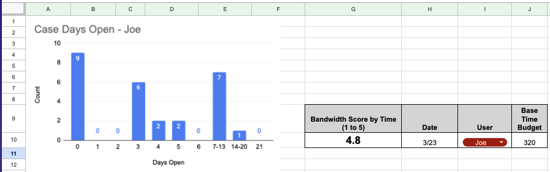
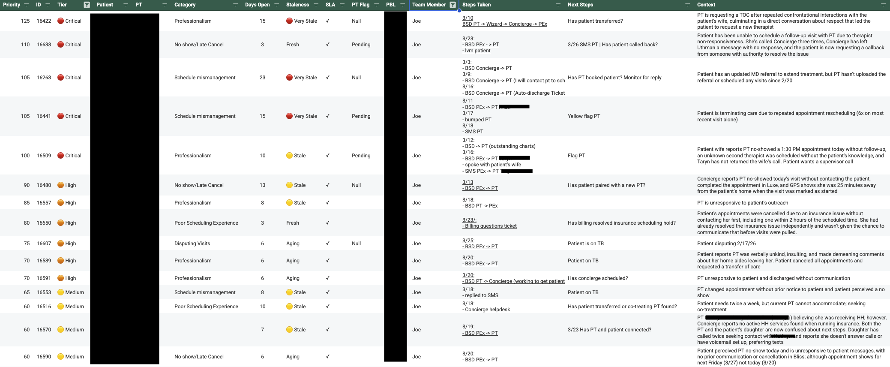
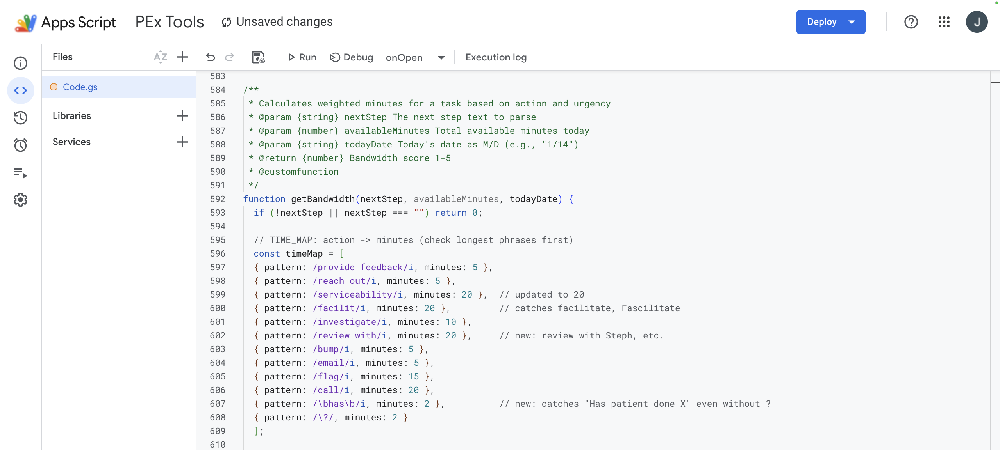
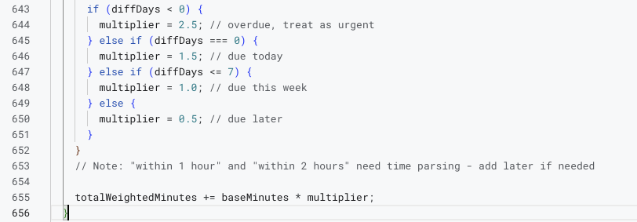

# Patient Experience Bandwidth Dashboard

> A Google Sheets + Apps Script tool that replaced subjective workload estimates
> for a healthcare operations team, cutting weekly reporting time by ~90%.

## The Problem

A Patient Experience team at a healthcare company managed escalations between patients and providers. Cases involved time-sensitive work where falling behind means missed follow-ups and degraded care outcomes. But the team had no way to objectively measure workload. When the supervisor asked "how's your bandwidth?", the answer was always a subjective feeling that is prone to recency bias and skewed perceptions.

Tasks lived in a shared spreadsheet, but nothing in that sheet answered the questions that actually mattered: *How long will these tasks take? Which ones are urgent? Who has capacity right now?*

Without that visibility, three problems compounded:

- **Uneven workload distribution** — no way to see who was overloaded versus who could absorb more cases
- **Subjective bandwidth estimates** — "I'm busy" meant different things to different people, making cross-team comparison impossible
- **No data for staffing decisions** — during a period of organizational restructuring, the supervisor had no evidence to advocate for headcount or push back on workload increases

## The Solution

### The Core Idea

I built a Google Sheets dashboard powered by custom Apps Script functions that converts free-text task notes into a real-time workload score (1–5 scale). One input (your name), one output (your bandwidth). No manual calculation, no subjective interpretation.

*The dashboard in action — a single glanceable score with a case aging distribution. User enters their name and today's date; the score calculates automatically.*

### Turning Text Into Time: The Keyword Engine

The central design challenge was that task data was unstructured, written in plain English by different team members with different habits. I needed a system that could extract actionable time estimates from messy text without requiring anyone to change how they wrote.

*The raw task sheet — each row is an open escalation case. The "Next Steps" column contains free-text action notes that the keyword engine parses into time estimates.*

The solution was a keyword-to-minutes mapping engine. The script scans each task's "Next Steps" field for action verbs and assigns calibrated time estimates:

| Action Type | Keywords | Minutes |
|-------------|----------|---------|
| Quick outreach | `bump`, `email`, `reach out`, `flag`, `provide feedback` | 5 |
| Status checks | `Has [X]?`, any `?` question | 2 |
| Research | `investigate`, `review with` | 10 |
| Active coordination | `facilitate`, `serviceability`, `call` | 20 |
| Unrecognized | No keyword match | 1 |

Multiple actions separated by `+` or `|` are summed (e.g., `Has patient called? + Bump PT` = 2 + 5 = **7 minutes**). This let team members write naturally while the system parsed accurately.

*The keyword engine in Apps Script using regex patterns ordered longest-first to avoid partial matches, with case-insensitive flags and inline comments documenting edge cases and common typos like "Fascilitate."*

### Urgency Multipliers

Time alone doesn't capture pressure. A 20-minute task due in an hour is a different problem than a 20-minute task due Friday. I applied urgency multipliers after base time calculation to keep the two dimensions separable:

| Urgency | Multiplier |
|---------|-----------|
| Overdue | 2.5× |
| Due within 1 hour | 2.5× |
| Due today | 1.5× |
| Due this week | 1.0× |
| No date listed | 1.5× (defaults to "due today") |

The "no date defaults to today" decision was deliberate — undated tasks tend to be unprocessed intake, which needs attention sooner rather than later.

*The urgency multiplier logic — clean conditional branching based on days until due date, applied after base time calculation to keep the two dimensions separable.*

### The Score

Total weighted task time ÷ available minutes = utilization ratio, mapped to a 1–5 scale. Base available time defaults to **320 minutes** (8-hour day minus lunch/breaks), adjustable for meetings.

| Score | Meaning |
|-------|---------|
| 1.0–1.9 | Light load |
| 2.0–2.9 | Steady day |
| 3.0–3.9 | Working day — steady stream of cases and tasks |
| 4.0–4.9 | Heavy — everything needs to be planned tight |
| 5.0 | At capacity — some cases may slip to prioritize critical ones |

## Impact

**Before:** The supervisor spent ~2 hours each week manually reviewing the task sheet, pinging team members for status updates, and assembling a rough picture of team capacity. Workload balancing was reactive — problems surfaced after someone was already underwater.

**After:**

- **Adopted by the team supervisor as a daily planning tool within the first week** — it replaced the "how's your bandwidth?" check-in with a glanceable number
- **Weekly reporting overhead dropped from ~2 hours to ~10 minutes** (~90% reduction)
- **Workload balancing shifted from reactive to proactive** — the supervisor could redistribute cases before anyone hit capacity
- **Provided the first objective data point for staffing conversations** during a period of organizational restructuring and headcount pressure
- In active daily use since launch (~1 month), with the team now writing next steps with the scoring system in mind — an unplanned behavioral shift that improved data quality organically

## Technical Details

**Stack:** Google Sheets + Google Apps Script (JavaScript)

**Architecture:** Three composable functions — `getBandwidth(teamMember)` as the entry point, `getRowMinutes(nextStepText)` for per-task parsing, and `calculateBandwidthScore(totalMinutes, availableMinutes)` for the final score. Deliberately kept modular so each layer could be tested and calibrated independently.

**Design decisions worth noting:**

- **Regex over exact match** — Case-insensitive regex with common misspelling coverage (e.g., "Fascilitate") meant I didn't need to train the team on precise syntax. The tool adapted to users, not the other way around.
- **Contains-match for names** — Typing "Joe" matches rows assigned to "Joe Pascual." Reduced friction and input errors to near zero.
- **Float precision** — Scores display as 3.5, not 3. The granularity made day-to-day shifts visible and gave the supervisor a reason to check daily rather than weekly.
- **Separable dimensions** — Urgency multipliers apply after base time, so you can reason about "how much work" and "how urgent" independently. This was a conscious modeling choice, not an implementation accident.
- **Excluded "Not Onboarded" rows** — Filtering out inactive cases automatically prevented score inflation from stale data.

**Known limitations:**

- Keyword matching is heuristic — unusual task descriptions may underestimate time
- Slack-submitted tickets aren't captured until manually entered into the sheet
- No calendar integration — available minutes require a manual adjustment for meetings

## What I'd Do Differently

- **SQL backend** — If rebuilding from scratch, I'd use PostgreSQL or BigQuery for better scalability, query flexibility, and historical trend analysis
- **Slack integration** — Automate ticket capture from Slack so nothing falls through the cracks between submission and manual entry
- **Proper frontend** — Build a lightweight web UI instead of relying on Sheets, enabling richer visualizations and easier team-wide access
- **Calendar API** — Pull meeting data automatically to calculate available minutes, removing the last manual input

## About

Built by **Joe Pascual** — currently in Patient Experience operations at a healthcare company. This project reflects how I approach problems: identify a measurement gap, build a system to close it, and make the output useful enough that people adopt it without being told to.

I'm looking for roles where I can apply this same pattern — turning messy operational data into reliable, automated insight — at a larger scale with proper data infrastructure.

- Portfolio: [josephpascual.github.io](https://josephpascual.github.io)
- LinkedIn: [linkedin.com/in/josephpascual](https://www.linkedin.com/in/josephpascual/)
